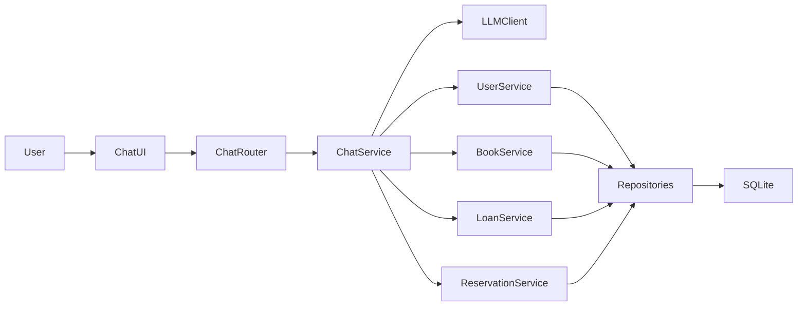

# LLM Integration Details

This document explains the design of the LLM-powered chat assistant added to the Digital Library API.

The current implementation is intentionally simple. It focuses on a clear integration pattern for LLM-assisted operations, tool-based orchestration, UX adaptation for a non-technical user, and safe coexistence with the existing layered backend.

## Purpose

This chat assistant was added as a lightweight extension to the existing API in order to:

- familiarity with LLM-driven UX
- ability to integrate an LLM with existing REST API
- understanding of tool-based orchestration instead of direct database access
- awareness of security and operational constraints around LLM usage

The implementation favors clarity and separation of concerns over advanced agent autonomy.

## High-Level Design

The existing API remains the system of record.

The chat assistant is an additive slice that sits on top of the current application and translates natural language requests into controlled backend actions.

## Main Components

### `app/routers/chat.py`

Exposes the chat-specific HTTP surface:

- `POST /chat`
- `GET /chat/ui`

This router does not contain LLM logic or business rules. It only wires dependencies and delegates to the chat service.

### `app/services/chat.py`

This is the orchestration layer for the assistant.

Responsibilities:

- build the prompt context
- send messages to the LLM
- provide a bounded set of tools the model may use
- execute approved tool calls through the existing domain services
- transform the LLM response into a user-facing reply
- keep the experience friendly for a non-technical operator

This is the key architectural decision of the feature: the LLM integration is isolated here, instead of being spread across the core domain services.

### `app/llm/client.py`

This file contains the OpenAI-compatible HTTP client wrapper.

It is intentionally small:

- reads configuration from `Settings`
- sends requests to `/chat/completions`
- returns the assistant message and any tool calls
- degrades gracefully when the provider is not configured

This keeps provider-specific HTTP behavior out of the router and the business services.

### `app/static/chat.html`

This is a deliberately simple frontend.

It was implemented as a static page served by FastAPI because:

- it keeps the feature lightweight
- it avoids adding a large frontend framework late in the project
- it allows the backend to remain the main focus

The page includes:

- a conversation area
- a text input
- send-on-enter behavior
- a small "thinking" indicator
- a natural-language, non-technical UI style

## Tooling Strategy

The assistant does not have open-ended access to the application.

Instead, it is given a bounded tool list such as:

- `list_users`
- `create_user`
- `list_books`
- `create_book`
- `check_book_availability`
- `create_loan`
- `return_loan`
- `renew_loan`
- `create_reservation`
- `get_reservation`

This means the model is used as an intent interpreter and conversational layer, not as an unrestricted executor.

## Request Flow

The current implementation uses a two-step tool flow:

1. the user sends a natural language request to `POST /chat`
2. the backend sends the conversation and tool definitions to the LLM
3. the LLM either:
   - replies directly, or
   - selects one tool with arguments
4. if a tool is selected, the backend executes that action through the existing service layer
5. the backend sends the tool result back to the LLM
6. the LLM returns a final natural-language answer for the user

This approach is simple and explicit, but it can increase latency because tool-assisted answers may require two LLM calls.

## Design Rationale

The design was chosen to preserve the project’s existing architecture:

- the REST API remains authoritative
- domain rules remain in the existing services
- the LLM does not replace the business layer
- the implementation remains small and maintainable

This is intentionally not a fully autonomous agent. It is a guided assistant on top of a conventional backend.

## Security Measures Adopted

Even though this is a basic implementation, some important safeguards were adopted.

### 1. Server-side tool execution only

The browser does not call the LLM provider directly.

Benefits:

- the API key stays on the server side
- tool execution stays under backend control
- future authorization or audit rules can be added in one place

### 2. Bounded tool surface

The model cannot arbitrarily execute code or access the database.

It can only choose from an explicitly defined list of allowed actions.

### 3. Existing business rules remain centralized

Even when the user speaks through chat, the actual state-changing operations still go through:

- `UserService`
- `BookService`
- `LoanService`
- `ReservationService`

That means the chat assistant cannot bypass validations such as:

- duplicate email checks
- inventory constraints
- loan limits
- reservation rules

### 4. ORM and database remain internal

The model never receives direct database access.

It interacts only through the tool contracts and service-layer responses.

### 5. Environment-based secret management

The provider key is read from environment variables through `pydantic-settings`.

That keeps the key out of the source code and aligned with standard backend configuration practices.

### 6. Graceful degradation

If the provider is disabled or unreachable, the chat returns a controlled fallback response instead of crashing the API.

### 7. Rate limiting

The chat endpoint is protected by rate limiting just like other state-changing or expensive flows.

This helps reduce accidental abuse and keeps the feature consistent with the project’s protective posture.

## UX Choices

The chat was intentionally adjusted for a non-technical operator, such as a librarian.

The UI avoids technical output and the assistant was instructed to:

- answer in Brazilian Portuguese
- avoid JSON-style wording
- avoid Markdown formatting
- use plain operational language
- explain outcomes in a practical way

The final result is closer to a helpful operational assistant than a developer console.

## Current Limitations

This implementation is intentionally basic.

Known limitations:

- no streaming responses yet
- tool-assisted answers may be slower because they may require two model calls
- the current chat memory is request-scoped and browser-managed
- there is no user authentication or role model attached to chat actions
- there is no audit trail specific to AI-originated actions yet
- response precision still depends partly on prompt quality and model behavior

These limitations are acceptable for the current scope because the primary goal was to keep the integration pattern clear without over-engineering an AI subsystem.

## Future Improvements

### Streaming

Add a dedicated streaming endpoint, likely separate from the existing `POST /chat`, so the UI can render tokens progressively without breaking the current simpler contract.

### Better response precision

Responses can become more deterministic by tightening prompt instructions and adding stronger response templates for common operations.

### Reduced entropy when needed

If stricter behavior is desired, future versions can expose model parameters such as:

- `temperature`
- token limits
- stricter tool-choice behavior

This would help reduce variability in operational responses.

### Better UX design

The current interface is intentionally simple. A future iteration could improve:

- spacing and layout polish
- clearer conversation grouping
- richer loading states
- operator-oriented empty/error states

### Better observability

Useful future additions:

- chat-specific logs
- latency metrics per LLM request
- tool usage metrics
- error classification for provider failures

### Better operational safety

Future hardening ideas:

- explicit confirmation flows before certain write actions
- audit logging for AI-triggered operations
- role-based access control if the project later gains authentication

## Summary

The LLM integration follows a simple and controlled design:

- the LLM was added as an additive orchestration layer, not as a replacement for the backend
- tool execution is bounded and server-side
- business rules remain in the existing service layer
- the implementation favors clarity, safety, and explainability over sophistication
